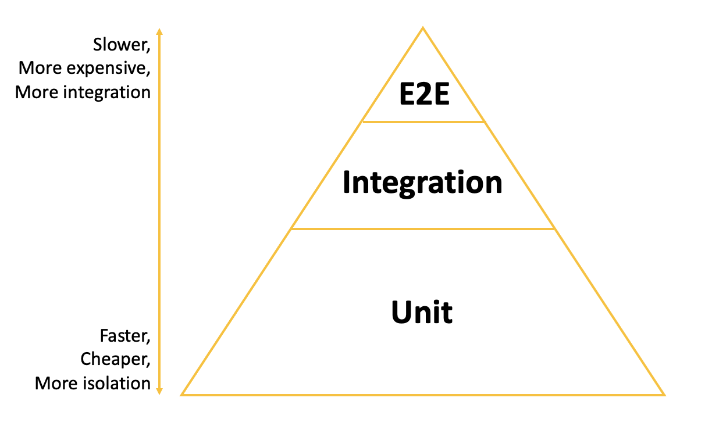

# Unit Testing

## Prerequisite
To follow this tutorial, you would need to install pytest and pytest-mock. I provided commands for both python library installation options: pip and poetry.

If you are using pip for installation (default):
```
python -m pip install pytest
python -m pip install pytest-mock
```
## What is Unit Testing and Test Pyramid?
Unit Testing is a software testing method to test the smallest piece of code that can be isolated, i.e. a function (method).

The concept of Test Pyramid as shown below, is introduced by Mike Cohn in his book Succeeding with Agile. It defines the testing strategy with a great visualization, covering the three major types of tests: unit tests, integration tests and end-to-end tests, and the proportion of each out of the entire testing strategy.

According to the pyramid, when it is at the bottom it normally means more isolated and faster tests (in other words: cheaper); while moving up the pyramid, it means more integrated and slower tests (in other words: expensive). At the tip of the pyramid could means manual testing. Thus, we should cover code with more automated unit tests and less manual tests.



## Why do we need Unit Testing?
People would tend to rush the requested feature delivering but ignoring the importance of writing test cases. The ignorance could be due to they see it as a waste of time and not seeing the damage it could cause.

### Identify bugs easily and early:
Unit test can help you verify what you want to develop. Without unit test, you would end up being caught by fixing random bugs when running entire application. And you may need to spend hours on placing breakpoints and tracing where does it come from.

### Help you write better code:
If you find it’s hard to write a test case for your own code, you probably would think about refactoring your code.

### Test at low cost:
Unit test is the fastest among all test cases as it removes all the dependencies.

### Serve as documentation:
People will understand what kind of input/output data type, format is when they look at your unit tests.

## What makes a good unit test then?
Below are the six qualities that will make a good unit test. How we could achieve the first four qualities are covered in the sections below.

### Independent
The testing is focusing on the function itself and NOT on all the dependencies, which include API call, DB connections, other functions from your application or third party libraries. All dependencies should be properly mocked.

Multiple assertions are allowed only if they are all testing one feature. When a test fails, it should pinpoint the location of the problem.

Tests should be isolated — not rely on each other. We shouldn’t make assumptions about the order of test execution.

### Fast

A good unit test’s response time should be less than a second. This is also a good and straightforward way to evaluate its independency. Any unit test taking longer than that should be questioned in terms of its dependency. And maybe that’s no longer unit test but integration test.

### Repeatable

The tests should produce the same output no matter when and how many time it runs.

### Readable (Consistency)

The test case serves part of the function documentation and it’s frequently read during debugging processes. Thus, it’s important to be understood easily. Try to stick to one naming convention for naming test file, test case, sequence of assertion (assert output == expect) and the way of writing mocks.

### Automatic

The process of running the unit tests should be integrated into CI/CD tool such as Jenkins, so the code quality can be continuously ensured with every new change.

This is not explained in this article. Feel free to read more about Jenkins, GitHub Actions or any CI/CD tools.

### Thorough (Coverage)

As mentioned in the Test Pyramid, we should get more unit tests as they are cheaper and faster. Coverage is the key metric to evaluate the degree of which source code has been tested. Any uncovered lines could result to a corner case bug one day with more expensive identification and resolving process.

Here is the formula to calculate code coverage, which is also called line coverage. This is mostly used.

```
Code Coverage = (Number of lines of code executed)/(Total Number of lines of code in a system component) * 100
```
If you ask me, what is the ideal code coverage that we should meet. There is no such thing that works for every product.

I would recommend to first reach 80% and make sure the coverage can be maintained with every single change, then continuously work on improving the code coverage towards 90%.

Efforts needed from 90% to 100% could be logarithmic, therefore usually target won’t go to as high as 100%.

## Structure
Below is a typical folder structure for a Python project/application, where you have a tests folder that is outside of your `src` folder.
```
.
├── docs                    # Documentation files (alternatively `doc`)
├── src                     # Source files (alternatively `lib` or `app`)
├── tests                    # Automated tests (alternatively `test`)
└── README.md
```

Create a file named `test_calc.py` inside the `tests` folder. The test file name should always start or end with test. You may read more about documentation on how test discovery works for pytest.

Write the test case `test_add` when writing the test cases, just define a function starting with test in the name. Similar as the file name. This provides a very clear understanding for others and this follows `Arrange-Act-Assert` pattern to structure the test content. Though this example is very simple and straightforward and we could replace it with one line assertion, but let’s just use it for illustration purpose.

`Arrange` the input and targets: Does the test needs some special settings? Does it needs to prepare the database? Most of the time, we need to get the inputs ready and also mockup the dependencies before we proceed with the `Act` step.

`Act` on the targets: This usually refers to calling the function or method in the Unit Testing scenario.

`Assert` expected outcomes: We will receive certain responses from `Act` step. And `Assert` step verifies the goodness or badness of that response. This could be checking whether numbers/strings are correct, whether particular type of Exception was triggered or certain function was being triggered. Assertions will ultimately determine if the test passes or fails.

For assertion statements (referring to <output == expected> part), generally, you could use any of logical conditions you would put similar as you write if statement.

How to run PyTestYou could run PyTest test cases with any of the below commands.

### Run all tests
```
python -m pytest tests -vv
```
### Run single test file
```
python -m pytest tests/test_calc.py
```
### Run single test case
```
python -m pytest tests/test_calc.py::test_add​
```
Try to think more situations where the function should be tested, so that you cover every aspect of it.

### Parametrizing
Here, let me introduce the pytest parametrizing decorator, which checks whether multiple inputs lead to expected output. It’s a little bit similar as looping through each of the 3 input set (a + b), however, the testing result will let you know whether each of them has passed. But writing a loop of asserting each of them would stop at the middle once it failed.

### Side Effects
When building your tests, you will likely come across cases where mocking a function’s return value will not be enough. This is because functions are often more complicated than a simple one-way flow of logic. Sometimes, you’ll want to make functions return different values when you call them more than once or even raise exceptions. You can do this using `.side_effect`.

### Fixtures
Fixture is a function with decorator that creates a resource and returns it. If you need the same test input for multiple test cases, you can use fixture to prepare the arrange step, just as the example below.

This reduces code duplications.

## More
### `patch()` as a Context Manager
Sometimes, you’ll want to use `patch()` as a context manager rather than a decorator. Some reasons why you might prefer a context manager include the following:
- You only want to mock an object for a part of the test scope.
- You are already using too many decorators or parameters, which hurts your test’s readability.

### `patch.object()` an Object’s Attributes
Let’s say you only want to mock one method of an object instead of the entire object. You can do so by using `patch.object()`.

### Where to Patch
Main module: `calender.py`
```
import requests
from datetime import datetime

def is_weekday():
    today = datetime.today()
    # Python's datetime library treats Monday as 0 and Sunday as 6
    return (0 <= today.weekday() < 5)

def get_holidays():
    r = requests.get('http://localhost/api/holidays')
    if r.status_code == 200:
        return r.json()
    return None
```

Knowing where to tell `patch()` to look for the object you want mocked is important because if you choose the wrong target location, the result of `patch()` could be something you didn’t expect.

Let’s say you are mocking `is_weekday()` in `my_calendar.py` using `patch()`:
#### test 1
```
import my_calendar
from unittest.mock import patch

with patch('my_calendar.is_weekday'):
     my_calendar.is_weekday()
```
result:
```
<MagicMock name='is_weekday()' id='4336501256'>
```
First, you import `my_calendar.py`. Then you patch `is_weekday()`, replacing it with a `Mock`. Great! This is working as expected.

Now, let’s change this example slightly and import the function directly:
#### test 2
```
from my_calendar import is_weekday
from unittest.mock import patch

with patch('my_calendar.is_weekday'):
    is_weekday()
```
result: False

Notice that even though the target location you passed to `patch()` did not change, the result of calling `is_weekday()` is different. The difference is due to the change in how you imported the function.

`from my_calendar import is_weekday` binds the real function to the local scope. So, even though you `patch()` the function later, you ignore the mock because you already have a local reference to the un-mocked function.

A good rule of thumb is to `patch()` the object where it is looked up.

In the first example, mocking `my_calendar.is_weekday()` works because you look up the function in the `my_calendar` module. In the second example, you have a local reference to `is_weekday()`. Since you use the function found in the local scope, you should mock the local function:
#### test 3
```
from unittest.mock import patch
from my_calendar import is_weekday

with patch('__main__.is_weekday'):
    is_weekday()

```
result:
```
<MagicMock name='is_weekday()' id='4502362992'>
```
Now, you have a firm grasp on the power of `patch()`. You’ve seen how to `patch()` objects and attributes as well as where to patch them.

Next, you’ll see some common problems inherent in object mocking and the solutions that `unittest.mock` provides

## Specifications
As mentioned before, if you change a class or function definition or you misspell a Python mock object’s attribute, you can cause problems with your tests.

These problems occur because Mock creates attributes and methods when you access them. The answer to these issues is to prevent Mock from creating attributes that don’t conform to the object you’re trying to mock.

When configuring a `Mock`, you can pass an object specification to the `spec` parameter. The `spec` parameter accepts a list of names or another object and defines the mock’s interface. If you attempt to access an attribute that does not belong to the specification, Mock will raise an `AttributeError`

Tests:
#### test 1
```
from unittest.mock import Mock
calendar = Mock(spec=['is_weekday', 'get_holidays'])

calendar.is_weekday()
```
result:
```
<Mock name='mock.is_weekday()' id='4569015856'>
>>> calendar.create_event()
Traceback (most recent call last):
  File "<stdin>", line 1, in <module>
  File "/usr/local/Cellar/python/3.6.5/Frameworks/Python.framework/Versions/3.6/lib/python3.6/unittest/mock.py", line 582, in __getattr__
    raise AttributeError("Mock object has no attribute %r" % name)
AttributeError: Mock object has no attribute 'create_event'
```
Here, you’ve specified that calendar has methods called `.is_weekday()` and `.get_holidays()`. When you access `.is_weekday()`, it returns a `Mock`. When you access `.create_event()`, a method that does not match the specification, `Mock` raises an `AttributeError`.

Specifications work the same way if you configure the Mock with an object:
#### test 2
```
import my_calendar
from unittest.mock import Mock

calendar = Mock(spec=my_calendar)
calendar.is_weekday()
```
result:
```
<Mock name='mock.is_weekday()' id='4569435216'>
>>> calendar.create_event()
Traceback (most recent call last):
  File "<stdin>", line 1, in <module>
  File "/usr/local/Cellar/python/3.6.5/Frameworks/Python.framework/Versions/3.6/lib/python3.6/unittest/mock.py", line 582, in __getattr__
    raise AttributeError("Mock object has no attribute %r" % name)
AttributeError: Mock object has no attribute 'create_event'
```
`.is_weekday()` is available to calendar because you configured calendar to match the `my_calendar` module’s interface.

Furthermore, `unittest.mock` provides convenient methods of automatically specifying a `Mock` instance’s interface.

One way to implement automatic specifications is `create_autospec`:
#### test 3
```
import my_calendar
from unittest.mock import create_autospec

calendar = create_autospec(my_calendar)
calendar.is_weekday()
```
result:
```
<MagicMock name='mock.is_weekday()' id='4579049424'>
>>> calendar.create_event()
Traceback (most recent call last):
  File "<stdin>", line 1, in <module>
  File "/usr/local/Cellar/python/3.6.5/Frameworks/Python.framework/Versions/3.6/lib/python3.6/unittest/mock.py", line 582, in __getattr__
    raise AttributeError("Mock object has no attribute %r" % name)
AttributeError: Mock object has no attribute 'create_event'
```
Like before, calendar is a `Mock` instance whose interface matches `my_calendar`. If you’re using `patch()`, you can send an argument to the autospec parameter to achieve the same result:
#### test 4
```
import my_calendar
from unittest.mock import patch

with patch('__main__.my_calendar', autospec=True) as calendar:
    calendar.is_weekday()
    calendar.create_event()
```
result:
```
<MagicMock name='my_calendar.is_weekday()' id='4579094312'>
Traceback (most recent call last):
  File "<stdin>", line 1, in <module>
  File "/usr/local/Cellar/python/3.6.5/Frameworks/Python.framework/Versions/3.6/lib/python3.6/unittest/mock.py", line 582, in __getattr__
    raise AttributeError("Mock object has no attribute %r" % name)
AttributeError: Mock object has no attribute 'create_event'
```